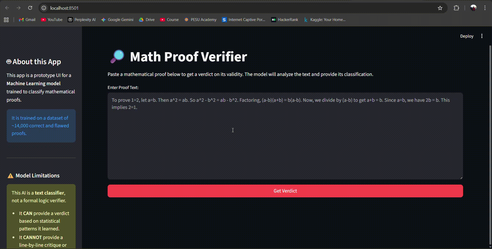

🔎 AI Math Proof Verifier 🤖

A machine learning project to automatically classify mathematical proofs as "Correct" or "Flawed", complete with an interactive Streamlit web app.

Test case 1 - 

Test case 2 -

📍 About The Project

This project is designed to automatically verify the correctness of mathematical proofs. It uses a Natural Language Processing (NLP) approach to learn the patterns of valid (and invalid) arguments from a labeled dataset.

The project is broken into two main parts:

train_model.py: A script that loads the dataset, processes the text using TfidfVectorizer, and performs a GridSearchCV to find the best classification model (e.g., LinearSVC). The best-performing pipeline is saved.

app.py: A user-friendly web application built with Streamlit. It loads the saved model and provides a simple interface to paste a proof and instantly get a "Correct" or "Flawed" verdict with a confidence score.

✨ Built With

This project is built with the following technologies:

Streamlit: For the interactive web application.

Scikit-learn: For the machine learning pipeline (TF-IDF, LinearSVC, GridSearchCV).

Pandas: For data loading and manipulation.

Joblib: For saving and loading the trained model.

🚀 Getting Started

Follow these steps to get a local copy up and running.

Prerequisites

You must have Python 3.8+ and pip installed on your system.

Installation

Clone the repository:

git clone [https://github.com/your-username/your-repository-name.git](https://github.com/your-username/your-repository-name.git)
cd your-repository-name

Create a requirements.txt file with the following content:

streamlit
scikit-learn
pandas
numpy
joblib

Install the required packages:

pip install -r requirements.txt

🖥️ Usage

Running the application is a two-step process.

1. Train the Model

First, you must run the training script. This will process the math_proof_verifier_dataset_14000_13.csv and create the proof_verifier_pipeline.joblib model file that the app needs.

python train_model.py

You should see output in your terminal indicating the model is being trained, evaluated, and finally saved.

2. Run the Streamlit App

Once the proof_verifier_pipeline.joblib file exists in your directory, you can launch the web application:

streamlit run app.py

This will open the application in your default web browser, ready to verify proofs!

📁 Project Structure

.
├── 📄 app.py               # The Streamlit web application
├── 📄 train_model.py       # The model training & evaluation script
├── 📄 math_proof_verifier_dataset_14000_13.csv  # The training data
├── 📄 requirements.txt     # (You create this)
└── 💾 proof_verifier_pipeline.joblib  # (Generated by train_model.py)

👥 Contributors

Meet the team that brought this project to life.

Your Name - (LinkedIn | Portfolio)

Collaborator Name - (LinkedIn)

(Just edit the links above with your information!)
